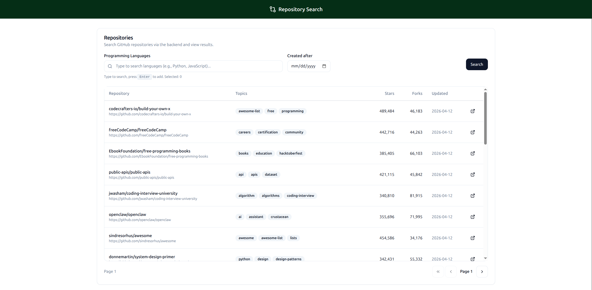

# Search Repository

A full-stack application for searching and filtering GitHub repositories with a custom ranking algorithm.



### Local Development

**Configuration:**

* Set `GITHUB_TOKEN` in `backend/.env` for higher rate limits (5000 req/hr vs 60 req/hr).
* Make sure you have Poetry and Node installed.

**Backend**:

```bash
cd backend
make install
make run
```

**Frontend:**

```bash
cd frontend
npm install
npm run dev
```

## Backend Overview

The backend is built with Python/Flask using clean architecture principles.

**Architecture:**

```
Routes (HTTP Layer)
    ↓
Controller (Request/Response handling)
    ↓
Service (Business Logic)
    ↓
Repository Provider (Abstraction)
    ↓
GitHub Client (API Integration)
```

**Key Components:**

- **Routes**: HTTP endpoint definitions
- **Controller**: Request validation, response formatting
- **Service**: Orchestrates fetching, scoring, sorting, and pagination
- **Provider**: Abstraction layer for data sources
- **GitHub Client**: GitHub API integration with DTOs

**Scoring Algorithm:**

Repositories are ranked using a weighted composite score:

```python
score = (
    log(stars + 1) * 0.5 +      # 50% stars
    log(forks + 1) * 0.2 +      # 20% forks  
    log(watchers + 1) * 0.1 +   # 10% watchers
    recency_factor * 0.2        # 20% recency
)

recency_factor = 1 / (1 + days_since_update / 30)
```

**Tech Stack:**

- Python 3.11+
- Flask
- Poetry (dependency management)
- Type hints throughout

## Frontend Overview

The frontend is a React application with TypeScript and MobX for state management.

**Architecture:**

```
UI Components
    ↓
MobX Store (State Management)
    ↓
Service Layer (Business Logic)
    ↓
API Client (HTTP)
```

**Key Components:**

- **Store**: MobX observable state with computed values and actions
- **Service**: Business logic (topic sorting, API communication)
- **Components**: React UI with TailwindCSS styling
- **Types**: Full TypeScript type safety

**Features:**

- Real-time search filtering
- Language multi-select with autocomplete
- Date filtering
- Pagination
- Responsive design

**Tech Stack:**

- React 19
- TypeScript
- Vite (build tool)
- TailwindCSS
- MobX (state management)
- ShadCN UI components

## API

**POST `/api/repositories`**

Search repositories with filters.

**Request Body:**

```json
{
  "languages": ["python", "javascript"],
  "created_after": "2024-01-01",
  "page": 1,
  "per_page": 25
}
```

**Response:**

```json
{
  "items": [
    {
      "id": 123456,
      "name": "repo-name",
      "full_name": "user/repo-name",
      "url": "https://github.com/user/repo-name",
      "stars": 1234,
      "forks": 567,
      "watchers": 890,
      "language": "Python",
      "topics": ["api", "framework"],
      "updated_at": "2026-04-10T12:00:00Z",
      "score": 8.5432
    }
  ],
  "pagination": {
    "page": 1,
    "per_page": 25,
    "total": 100,
    "has_next": true,
    "has_previous": false
  }
}
```

**GET `/api/languages`**

Get language suggestions for autocomplete.

**Query Parameters:**

- `q` (optional): Search query

**Response:**

```json
["JavaScript", "Java", "Python"]
```

## Project Structure

```
search-repo/
├── backend/
│   ├── src/
│   │   ├── features/repositories/     # Repository domain
│   │   ├── integrations/github/       # GitHub API client
│   │   └── shared/                    # Shared utilities
│   └── pyproject.toml
├── frontend/
│   ├── src/
│   │   ├── pages/repositories/        # Repository search feature
│   │   └── shared/                    # Shared components & utilities
│   └── package.json
```

## License

MIT
